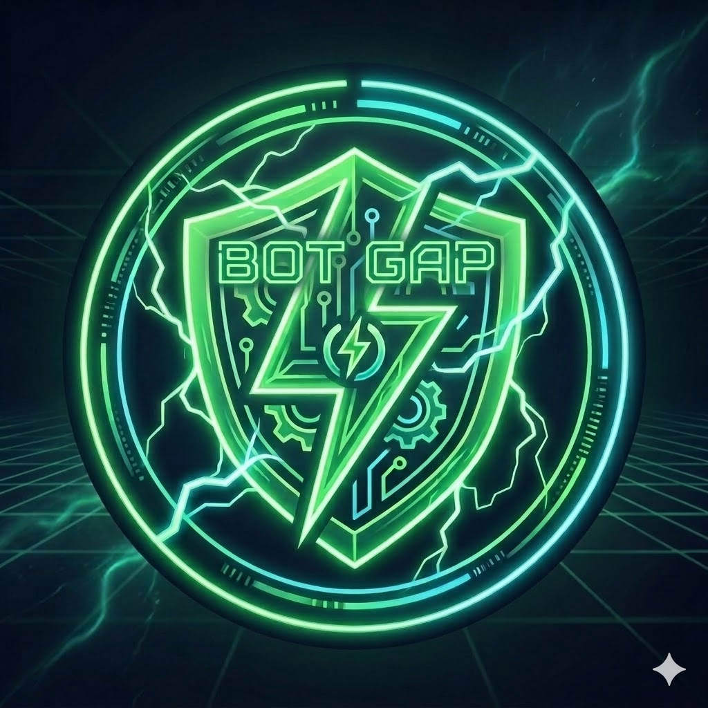

# 🤖 Discord XP & Level Bot

<p align="center">
  
</p>

<p align="center">
  
</p>

A feature-rich Discord bot built with Python that tracks user activity, rewards XP, levels users up, and assigns roles automatically.

---

## 🚀 Features

* 💬 Earn XP by sending messages
* 🔊 Earn XP by spending time in voice channels
* 📈 Automatic level-up system
* 🎖️ Role rewards based on level progression
* 🏆 `!rank` command to view user stats
* 📊 SQLite database for persistent data storage
* ⚡ Anti-spam cooldown system

---

## 🛠️ Tech Stack

* Python
* discord.py
* SQLite

---

## 📂 Project Structure

```
discord-xp-bot/
│── bot.py
│── database.db
│── .env
│── .gitignore
│── README.md
│── assets/
│   ├── banner.jpg
│   └── logo.jpg
```

---

## ⚙️ Setup

### 1. Clone the repository

```
git clone https://github.com/yourusername/discord-xp-bot.git
cd discord-xp-bot
```

### 2. Install dependencies

```
pip install -r requirements.txt
```

### 3. Create a `.env` file

Create a file named `.env` in the root directory and add:

```
DISCORD_TOKEN=your_bot_token_here
```

---

## ▶️ Run the Bot

```
python bot.py
```

---

## 🔐 Security

* Never share your bot token
* Keep your `.env` file private
* Make sure `.env` is included in `.gitignore`

---

## 🎮 Level & Role System

Users gain XP through activity and level up automatically.
Roles are assigned based on level milestones:

* Tiny Gapper – 🍃
* Starter Gapper – 🐣
* Rookie Gapper – 🎒
* Mini Gapper – 🌱
* Junior Gapper – 🧩
* Skilled Gapper – ⚙️
* Advanced Gapper – 🔧
* Pro Gapper – 🎮
* Elite Gapper – 💠
* Epic Gapper – 🔥
* Mythic Gapper – ⚡
* Legendary Gapper – 🏆
* Godlike Gapper – 👑
* Immortal Gapper – ♾️
* Master Gapper – 🛡️

---

## 📌 Commands

* `!ping` → Check if the bot is online
* `!rank` → Display your XP and level
* `!roles` → Show all level-based role rewards

---

## ⚠️ Requirements

* Python 3.9 or higher
* A Discord bot token

---

## 📜 License

This project is open-source and free to use.
