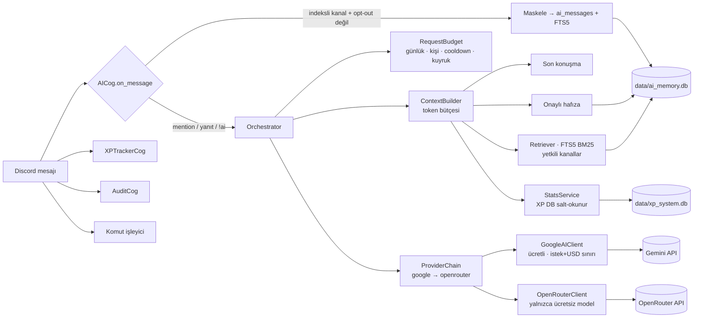

# 🤖 Discord XP & Level Bot — Bot-GAP

<p align="center">
  
</p>

---

A feature-rich, high-performance Discord bot built with Python and Pillow that tracks user activity, rewards XP (text & voice), manages streaks, tracks voice pairs ("Best Friend"), levels users up, and renders gorgeous image cards.

---

## 🚀 Features

* 💬 **Mesaj XP:** Mesaj başına cooldown korumalı dinamik XP kazanımı.
* 🔊 **Ses XP & Takip:** Ses kanallarında geçirilen süreyi hassas biçimde kaydetme.
* 👥 **Best Friend Sistemi (`!bf`):** Ortak ses süresini takip eden ve 100 saatlik eşiğe göre özel çift kartı üreten sistem.
* 🎴 **Görsel Kullanıcı Kartı (`!kart`):** Pillow ile oluşturulan seviye, rol ve ilerleme kartı.
* 🏆 **Liderlik Sıralaması (`!liderlik`):** Sunucudaki ilk 10 kullanıcının madalyalı görsel sıralama kartı.
* 🗺️ **Rol Haritası (`!roller`):** Seviye kilitlerini ve XP hedeflerini gösteren görsel rol yol haritası.
* 🔥 **Günlük Seri (Streak):** Düzenli katılım için çarpanlı XP ödülleri.
* 📊 **SQLite WAL Modu:** Hızlı ve thread-safe asenkron veritabanı mimarisi (`aiosqlite`).

---

## 🛠️ Tech Stack

* Python 3.10+
* discord.py (v2)
* Pillow (PIL)
* aiosqlite (SQLite WAL)

---

## 📂 Project Structure

```
Bot-GAP/
├── Main.py              # Bot giriş noktası ve cog yükleyici
├── usercard.py          # !kart kullanıcı profili kart üretimi
├── leaderboard.py       # !liderlik ve !roller görsel kart üretimi
├── bestfriend.py        # !bf ses çifti takibi ve kart üretimi
├── rolescard.py         # XP rol haritası kart tasarımı
├── font_utils.py        # Font/glif temizleme ve emoji fallback yardımcıları
├── info.py              # !yardim, !yenilikler (changelog) ve ping komutları
├── audit.py             # Olay kaydı dinleyicileri, canlı hile dedektörü, analiz komutları
├── activitylog.py       # Log dosyası kurulumu ve toplu olay yazıcısı (activity_log)
├── analysis.py          # Geçmişe dönük hile/kasma analizi (CLI olarak da çalışır)
├── xp.py                # XP olayları, ses döngüleri ve komutlar
├── xproles.py           # Seviye eşikleri ve rol yönetimi
├── database.py          # Merkezi asenkron SQLite veritabanı
├── ai/                  # İsteğe bağlı AI sohbet & hafıza eklentisi (bkz. "Yapay Zekâ")
├── persona/default.md   # Düzenlenebilir bot kişiliği
├── tests/               # pytest testleri (AI + regresyon)
├── requirements.txt     # Bağımlılıklar
├── Dockerfile           # Konteyner yapılandırması
├── docker-compose.yaml  # Docker Compose dağıtım dosyası
└── assets/
    ├── banner.jpg       # Sunucu afişi
    ├── logo.jpg         # Bot logosu
    └── fonts/           # DejaVuSans TrueType fontları
```

---

## ⚙️ Setup

### 1. Clone the repository

```bash
git clone https://github.com/talhacuce87/Bot-GAP.git
cd Bot-GAP
```

### 2. Install dependencies

```bash
python -m venv .venv
source .venv/bin/activate  # Windows: .venv\Scripts\activate
pip install -r requirements.txt
```

### 3. Create a `.env` file

Create a file named `.env` in the root directory and add:

```env
DISCORD_TOKEN=your_bot_token_here
BOT_PREFIX=!
# İsteğe bağlı: şüpheli hareket ve admin işlemi bildirimlerinin gideceği kanal
LOG_CHANNEL_ID=123456789012345678
# İsteğe bağlı: yeni sürüm açıldığında güncelleme notlarının otomatik paylaşılacağı kanal
ANNOUNCE_CHANNEL_ID=123456789012345678
# İsteğe bağlı: log dosyası (gün) ve olay kaydı (gün) saklama süreleri
LOG_FILE_RETENTION_DAYS=90
EVENT_RETENTION_DAYS=365
```

---

## ▶️ Run the Bot

```bash
python Main.py
```

Or run via Docker:

```bash
docker compose up -d --build
```

---

## 📌 Commands

### 👥 Kullanıcı Komutları
* `!yardim` (alias: `!help`, `!komutlar`) → Tüm bot komutlarını ve açıklamalarını kategorize edilmiş embed olarak listeler.
* `!yenilikler` (alias: `!changelog`, `!surum`, `!guncelleme`) → Son deploy ve güncellemede gelen tüm yeni özellikleri gösterir.
* `!kart [@kullanıcı]` → Seviye, XP ve istatistik kartını görsel olarak gösterir.
* `!liderlik` (alias: `!lb`, `!top`) → Sunucu içi ilk 10 XP sıralama kartını oluşturur.
* `!roller` (alias: `!roles`, `!xproller`) → Seviye rol yol haritasını görsel kart olarak gösterir.
* `!bf [@kullanıcı]` → En çok vakit geçirilen ses partnerini ve 100 saatlik Best Friend durumunu gösterir.
* `!xp` → Detaylı metin tabanlı XP ve rol durumu embed'i gönderir.
* `!streak` → Günlük seri ve aktif çarpan durumunu görüntüler.
* `!feature <istek>` → Bot geliştiricisine özellik önerisi kaydeder.
* `!ping` → Bot gecikme ve WebSocket ping süresini ölçer.

### 🛡️ Yönetici Komutları
* `!yedekle` (alias: `!backup`) → Veritabanının anlık yedeğini güvenle alır.
* `!xpayarla @kullanıcı <miktar>` → Kullanıcının toplam XP'sini doğrudan ayarlar.
* `!xpekle @kullanıcı <miktar>` → Kullanıcıya XP ekler veya çıkarır.
* `!boost @kullanıcı <çarpan> [saat]` → Süreli XP boost çarpanı uygular.
* `!xpsenkronize` → Sunucudaki tüm üyelerin XP rollerini baştan kontrol edip senkronize eder.

AI komutları için aşağıdaki **🧠 Yapay Zekâ Sohbet & Hafıza** bölümüne bak.

---

## 📜 License

This project is open-source and free to use.

---

## 🕵️ Loglama & Hile Analizi

**Log dosyaları:** `data/logs/bot.log` (her gece döner, 90 gün saklanır). `data/` volume olduğu için redeploy'da silinmez.

**Olay kaydı (`activity_log` tablosu):** mesaj metadatası (içerik değil; uzunluk + hash), XP kazanımları (mesaj/ses/streak), seviye ve rol değişimleri, ses giriş/çıkış/mute/yayın, üye giriş/çıkış (hesap yaşı), mesaj silme/düzenleme, komutlar ve hatalar, tüm admin işlemleri ve şüpheli hareket bayrakları.

**Canlı dedektör** (`LOG_CHANNEL_ID` kanalına bildirir):
* `tekrar_mesaj` — aynı içerik tekrar tekrar
* `makro_zamanlama` — mesaj aralıkları neredeyse sabit (makro / self-bot)
* `cooldown_kasma` — mesajlar tam XP cooldown'ı dolunca atılıyor
* `sessiz_ses_kasma` — kanaldaki herkes 30+ dk mikrofonu kapalı ses XP'si alıyor
* `yeni_hesap_ses` — 14 günden yeni hesap ses XP'si alıyor

**Komut satırından analiz** (sunucuda):

```bash
docker exec <container> python analysis.py --guild <sunucu_id> --days 30
docker exec <container> python analysis.py --guild <sunucu_id> --user <üye_id> --days 90
docker exec <container> python analysis.py --guild <sunucu_id> --legacy   # kayıt öncesi toplam verilerden
```

---

## 🚀 Yeni Sürüm Yayınlama

1. `info.py` içinde `BOT_VERSION` ve `LAST_DEPLOY_DATE` değerlerini güncelle.
2. `_build_changelog_embed()` içindeki notları yeni sürüme göre yaz.
3. Deploy et. Bot açılınca sürüm numarası son duyurulandan farklıysa notları `ANNOUNCE_CHANNEL_ID` kanalına **bir kez** paylaşır (`data/announced_version.txt`). Sürüm numarası değişmeden yapılan yeniden başlatmalarda tekrar paylaşmaz.

---

## 🧠 Yapay Zekâ Sohbet & Hafıza (isteğe bağlı)

Bot-GAP, Google AI Studio (Gemini, ücretli) ve/veya OpenRouter'ın **ücretsiz** modelleriyle konuşabilen, onaylı kanallardaki sohbetleri
hatırlayabilen hafif bir AI eklentisi içerir. `AI_ENABLED=false` (varsayılan) iken hiçbir AI kodu
yüklenmez; bot eskisi gibi çalışır.

### Durum: tamamlanan / planlanan

| Özellik | Durum |
|---|---|
| `@Bot-GAP` mention, bota yanıt ve `!ai` ile sohbet | ✅ |
| OpenRouter istemcisi (zaman aşımı, geri çekilme, 429/Retry-After, devre kesici, ücretsiz model doğrulaması) | ✅ |
| Ayrı `data/ai_memory.db`, idempotent migration, WAL, online backup | ✅ |
| Kanal bazlı indeksleme (varsayılan kapalı), kullanıcı opt-out, hassas veri maskeleme | ✅ |
| Mesaj düzenleme/silme senkronu, saklama süresi, `!unuttur` | ✅ |
| FTS5 sözcüksel RAG (Türkçe katlama, önek/ek kırpma, tarih/yazar filtresi, bağlam penceresi, kaynak linkleri) | ✅ |
| Kullanıcı hafızası (aday → onay), episodik anılar, plan adayları | ✅ |
| XP / liderlik / streak / Best Friend sorularını gerçek veritabanından cevaplama | ✅ |
| Günlük/kişisel bütçe, cooldown, eşzamanlılık + sınırlı kuyruk | ✅ |
| Slash komutları (hybrid) | ✅ kod hazır, `AI_SLASH_SYNC=true` ile kaydedilir |
| Google AI Studio (Gemini API) sağlayıcısı, sağlayıcı zinciri, günlük istek + USD sınırı | ✅ |
| Embedding/semantik arama, LLM ile hafıza özetleme, sunucu başına model seçimi | ⏳ planlanan |
| Sesli kanal / görsel girdi | ❌ kapsam dışı |

### Mimari


```mermaid
flowchart LR
    D[Discord mesajı] --> L{AICog.on_message}
    D --> XP[XPTrackerCog] & AU[AuditCog] & CMD[Komut işleyici]
    L -->|indeksli kanal + opt-out değil| ING[Maskele → ai_messages + FTS5]
    L -->|mention / yanıt / !ai| ORC[Orchestrator]
    ORC --> BUD[RequestBudget<br/>günlük · kişi · cooldown · kuyruk]
    ORC --> CTX[ContextBuilder<br/>token bütçesi]
    CTX --> REC[Son konuşma]
    CTX --> MEM[Onaylı hafıza]
    CTX --> RAG[Retriever · FTS5 BM25<br/>yetkili kanallar]
    CTX --> ST[StatsService<br/>XP DB salt-okunur]
    ORC --> PC[ProviderChain<br/>google → openrouter]
    PC --> GG[GoogleAIClient<br/>ücretli · istek+USD sınırı]
    PC --> OR[OpenRouterClient<br/>yalnızca ücretsiz model]
    GG --> GAPI[(Gemini API)]
    OR --> API[(OpenRouter API)]
    ING --> DB[(data/ai_memory.db)]
    RAG --> DB
    MEM --> DB
    ST --> XDB[(data/xp_system.db)]
```

`ai/` paketi: `config` (env) · `storage` (SQLite) · `migrations` · `openrouter` / `google` (sağlayıcılar) · `providers` (zincir) ·
`budget` (kota) · `guard` (güvenlik/gizlilik) · `retrieval` (FTS5) · `context` (prompt) ·
`memory` (hafıza politikası) · `stats` (Bot-GAP verisi) · `persona` · `orchestrator` · `cog` (Discord).

### Kurulum

1. https://openrouter.ai/keys adresinden API anahtarı al.
2. `.env` dosyasına ekle (tüm değişkenler için `.env.example`):
   ```env
   AI_ENABLED=true
   OPENROUTER_API_KEY=sk-or-v1-...
   OPENROUTER_MODEL=google/gemma-4-31b-it:free
   OPENROUTER_FALLBACK_MODEL=nvidia/nemotron-3-super-120b-a12b:free,openrouter/free
   ```
3. `docker compose up -d --build` (veya `pip install -r requirements.txt && python Main.py`).
4. Sunucuda bir yönetici hafızayı açmak istediği kanalda: `!aiayar kanal ekle` — bot kanala bir
   bilgilendirme mesajı bırakır.
5. `!aidurum` ile modeli ve kotayı kontrol et.

**Ücretsiz model seçimi:** Varsayılan `google/gemma-4-31b-it:free` (akıl yürütmesi varsayılan kapalı,
Türkçesi iyi). `openrouter/free` her istekte rastgele bir ücretsiz modele yönlendirir; bunların çoğu
"reasoning" modelidir ve bazıları düşünme metnini cevaba sızdırır, bu yüzden yalnızca yedek olarak
önerilir. Bot akıl yürütmeyi varsayılan olarak kapatır (`AI_REASONING_EFFORT=none`), `<think>` bloklarını
siler ve düşünme metni gibi görünen cevapları kullanıcıya göndermeden yeniden dener.

**Sağlayıcı yoğunluğu (429 "Provider returned error"):** Ücretsiz modelin arkasındaki sağlayıcı
(ör. Gemma için Google AI Studio) sınır koyduğunda bot aynı modeli tekrar denemez; modeli 2 dakika
(veya `Retry-After` kadar, en çok 15 dk) soğumaya alır ve sıradaki yedeğe geçer. Soğumadaki modeller
`!aiayar` çıktısında görünür. Yedek olarak farklı sağlayıcıdaki bir model seçmek bu yüzden önemlidir. Bot açılışta ve 6 saatte bir `/api/v1/models` üzerinden
fiyatı doğrular; fiyatı `0` olmayan (değişken fiyatlı `openrouter/auto` dahil) model
`AI_ALLOW_PAID_MODELS=true` olmadıkça **asla** çağrılmaz. İsteklere ayrıca
`provider.max_price = 0` eklenir ve yanıtta ücret raporlanırsa sağlayıcı kapatılır.
Ücretsiz modeller zamanla değişebilir/kaldırılabilir; `!aidurum` hatası görürsen modeli güncelle.

**OpenRouter ücretsiz kotası** (2026-10 itibarıyla): dakikada 20 istek; günde 50 istek
(hesaba toplam 10$+ kredi yüklenmişse 1000). `AI_DAILY_REQUEST_BUDGET` bunun altında tutulmalı.

### Google AI Studio (ücretli, isteğe bağlı)

`GOOGLE_AI_API_KEY` verildiğinde Google varsayılan olarak **birincil** sağlayıcı olur
(`AI_PROVIDER_ORDER=google,openrouter`); hata, kota veya bütçe dolması durumunda OpenRouter'ın ücretsiz
modellerine düşülür. Faturalandırması açık bir projenin anahtarıyla **her istek ücretlendirilir**.

- Varsayılan model `gemini-3.8-flash` ($0.75 / $3.75 her 1M giriş/çıkış token; 1 Ocak 2027'den itibaren
  $1.50 / $7.50). Tipik bir cevap ~$0.0015–0.0025. Gemini 3+ modellerinde düşünme kapatılamaz,
  `minimal` seviyede çalışır ve düşünme tokenları çıktı olarak ücretlendirilir.
- Daha ucuz alternatifler: `gemini-3.1-flash-lite` (~$0.0005/cevap), `gemini-2.5-flash-lite`
  (~$0.0002/cevap, düşünme tamamen kapalı).
- **Sert sınırlar** (UTC gün, yeniden başlatmada korunur): `GOOGLE_AI_DAILY_REQUEST_BUDGET` (varsayılan 1000)
  ve `GOOGLE_AI_DAILY_COST_LIMIT_USD` (varsayılan $5). Biri dolunca Google o gün kullanılmaz.
- Maliyet, yanıttaki token sayıları × `GOOGLE_AI_PRICE_*_PER_M` ile **tahmin** edilir (Google bu uç noktada
  ücret raporlamaz). Model veya fiyat değişirse bu değerleri güncelle. Kesin fatura için Google Cloud
  Console → Billing; ayrıca orada bir **bütçe uyarısı** kurman önerilir.
- `!aidurum` / `!aiayar` sağlayıcı başına günlük istek sayısını ve tahmini harcamayı gösterir.
- Google hataları: dakikalık 429 → `retryDelay` kadar bekleyip tekrar (30 sn'den uzunsa yedeğe geçer);
  günlük kota 429 → model 15 dk soğumaya alınır; geçersiz anahtar → Google 30 dk devre dışı.

### Ortam değişkenleri

| Değişken | Varsayılan | Açıklama |
|---|---|---|
| `AI_ENABLED` | `false` | Eklentiyi aç/kapat |
| `GOOGLE_AI_API_KEY` | – | Google AI Studio anahtarı (loglanmaz; **ücretli olabilir**) |
| `GOOGLE_AI_MODEL` / `GOOGLE_AI_FALLBACK_MODEL` | `gemini-3.8-flash` / – | Google modeli ve virgülle ayrılmış yedekleri |
| `GOOGLE_AI_DAILY_REQUEST_BUDGET` / `GOOGLE_AI_DAILY_COST_LIMIT_USD` | `1000` / `5` | Google için sert günlük sınırlar |
| `GOOGLE_AI_PRICE_INPUT_PER_M` / `GOOGLE_AI_PRICE_OUTPUT_PER_M` | `0.75` / `3.75` | Maliyet tahmini için birim fiyat (USD/1M token) |
| `GOOGLE_AI_MAX_OUTPUT_TOKENS` | `800` | Google yanıt sınırı (düşünme dahil) |
| `GOOGLE_AI_REASONING_EFFORT` | `auto` | `auto` / `none` / `minimal` / `low` … / `off` (gönderme) |
| `AI_PROVIDER_ORDER` | `google,openrouter` | Sağlayıcı sırası |
| `OPENROUTER_API_KEY` | – | OpenRouter anahtarı (loglanmaz) |
| `OPENROUTER_MODEL` | `google/gemma-4-31b-it:free` | Birincil model |
| `OPENROUTER_FALLBACK_MODEL` | – | Virgülle ayrılmış yedek modeller, sırayla (sadece ücretsizler) |
| `AI_ALLOW_PAID_MODELS` | `false` | Ücretli modellere izin |
| `AI_ENFORCE_ZERO_PRICE` | `true` | İsteğe `provider.max_price=0` ekle |
| `AI_MAX_OUTPUT_TOKENS` | `350` | Yanıt token sınırı |
| `AI_CONTEXT_TOKEN_BUDGET` | `3000` | Yaklaşık prompt bütçesi |
| `AI_MAX_CONCURRENT_REQUESTS` / `AI_MAX_QUEUE_SIZE` | `1` / `4` | Eşzamanlılık ve bekleme kuyruğu |
| `AI_REQUEST_TIMEOUT_SECONDS` / `AI_TOTAL_DEADLINE_SECONDS` | `45` / `90` | Deneme ve toplam süre sınırı |
| `AI_MAX_RETRIES` / `AI_MAX_RETRY_WAIT_SECONDS` | `2` / `30` | Yeniden deneme sayısı ve en uzun bekleme |
| `AI_REASONING_EFFORT` | `none` | `none` = akıl yürütme kapalı (önerilen); `low`/`medium`/`high` = açık ama gizli; boş = parametre gönderme |
| `AI_RESPONSE_MODE` | `mention` | `mention` veya `command` (sadece `!ai`) |
| `AI_MEMORY_ENABLED` | `true` | Uzun süreli hafıza |
| `AI_INDEXING_DEFAULT` | `false` | `true` → tüm metin kanalları varsayılan indekslenir (önerilmez) |
| `AI_MESSAGE_RETENTION_DAYS` | `30` | Mesaj saklama (sunucu bazında `!aiayar saklama`) |
| `AI_CANDIDATE_RETENTION_DAYS` | `14` | Onaylanmamış aday hafıza ömrü |
| `AI_DAILY_REQUEST_BUDGET` | `35` | OpenRouter günlük istek (UTC; her HTTP denemesi sayılır) |
| `AI_USER_DAILY_REQUEST_LIMIT` | `0` | Kişi başı günlük başarılı cevap sınırı (0 = sınırsız; maliyeti sağlayıcı bütçeleri korur) |
| `AI_CHANNEL_COOLDOWN_SECONDS` / `AI_USER_COOLDOWN_SECONDS` | `15` / `30` | Cooldown'lar |
| `AI_RECENT_CONTEXT_MESSAGES` | `25` | Kısa süreli bağlam penceresi |
| `AI_SEARCH_RESULTS` / `AI_FINAL_PASSAGES` / `AI_NEIGHBOR_MESSAGES` | `10` / `5` / `2` | RAG sınırları |
| `AI_SLASH_SYNC` | `false` | Açılışta slash komutlarını kaydet |
| `AI_DB_PATH` / `AI_PERSONA_DIR` | `data/ai_memory.db` / `persona/` | Yol geçersiz kılma |

### Komutlar

Kullanıcı: `@Bot-GAP <mesaj>` · `!ai <mesaj>` · `!hatirla <konu>` (LLM kotası harcamaz) ·
`!hafizam` (DM) · `!hafizaekle <bilgi>` · `!onayla <id>` · `!unut <id>` · `!unuttur [onay]` ·
`!aigizlilik [ac|kapat]` · `!ani <metin> [@üyeler]` · `!anilar` · `!aiyardim` · `!aidurum`

Yönetici (`administrator`): `!aiayar` (durum) · `!aiayar ac|kapat` · `!aiayar kanal ekle|cikar [#kanal]` ·
`!aiayar mod mention|command` · `!aiayar cooldown <sn>` · `!aiayar saklama <gün>` ·
`!aiayar bakim` · `!aiayar yedekle`. Tüm ayar değişiklikleri `activity_log`'a `admin_ai_*` olarak yazılır.

"Kim en yüksek seviyede?", "seviyem kaç?", "@x'in streak'i", "best friend'im kim?" gibi sorular
XP veritabanından **salt-okunur** okunur ve modele doğrulanmış veri olarak verilir; model
kullanılamazsa bu veriler doğrudan gösterilir.

### Gizlilik ve saklama

- Kanal indeksleme **varsayılan kapalı**; yalnızca `!aiayar kanal ekle` ile açılan kanallardaki,
  komut olmayan, bot/webhook olmayan mesajlar saklanır. DM'ler asla saklanmaz.
- E-posta, telefon, IBAN, kart (Luhn), TC kimlik, token/API anahtarı ve "şifrem: …" kalıpları
  kaydetmeden önce `[gizlendi]` ile maskelenir.
- Geçmiş arama, **o anki** Discord izinlerine göre yapılır: kanal hem soran üye tarafından
  okunabilmeli hem de ya yanıtın verildiği kanal olmalı ya da @everyone'a açık olmalı. Böylece
  özel kanal içeriği herkese açık bir kanalda yanıt olarak sızmaz.
- Silinen mesaj içeriği hemen silinir (FTS'den de); yalnızca tekrar eklenmeyi önleyen bir ID
  kalır ve saklama süresinde temizlenir. Tek kaynağı silinen, onaylanmamış türetilmiş hafızalar iptal edilir.
- Otomatik çıkarılan bilgiler ("en sevdiğim oyun X") yalnızca **aday** olur, kullanıcı
  `!onayla` demedikçe prompt'a girmez.
- Sağlayıcıya (Google / OpenRouter) yalnızca ilgili istek için seçilmiş kısa bağlam gönderilir; kanal
  geçmişinin tamamı gönderilmez. Sağlayıcılar gönderilen veriyi kendi koşullarına göre işleyebilir
  (ücretsiz katmanlarda eğitim amaçlı kullanım dahil olabilir).
- Saklama: varsayılan 30 gün (sunucu bazında değiştirilebilir); bakım 6 saatte bir çalışır.
- Bilinen not: mevcut `AuditCog`, tüm komutların ilk 200 karakterini `activity_log`'a yazar;
  bu `!ai` sorularını da kapsar (mevcut davranış, değiştirilmedi; `EVENT_RETENTION_DAYS` ile sınırlı).

### Yedekleme ve geri yükleme

- AI veritabanı her gün `data/backups/ai_memory_YYYYMMDD.db` olarak **SQLite online backup API**
  ile yedeklenir (son 7 tutulur); elle: `!aiayar yedekle`.
- Geri yükleme: botu durdur → `cp data/backups/ai_memory_YYYYMMDD.db data/ai_memory.db` →
  `rm -f data/ai_memory.db-wal data/ai_memory.db-shm` → botu başlat.
- `data/` volume'ü sayesinde hem `xp_system.db` hem `ai_memory.db` redeploy'da korunur.

### Sorun giderme

| Belirti | Neden / çözüm |
|---|---|
| "AI yapılandırılmamış" | `OPENROUTER_API_KEY` boş |
| "yapılandırma hatası… devre dışı" | Anahtar 401/403 aldı; 30 dk sonra veya yeniden başlatınca tekrar denenir. Anahtarı kontrol et |
| "ücretsiz olarak doğrulanamadı" | Model ücretli, değişken fiyatlı veya listede yok; `:free` model seç |
| "Bugünlük … kota doldu" | Yerel bütçe veya OpenRouter günlük ücretsiz kotası; UTC gece yarısı sıfırlanır |
| "Model boş yanıt döndü" | Model düşünmeye token harcadı veya düşünme metni sızdırdı (log: "düşünme metnini cevaba sızdırdı"). `AI_REASONING_EFFORT=none` olduğundan ve `OPENROUTER_MODEL`'in `openrouter/free` olmadığından emin ol |
| Sürekli 404 / "No endpoints" | Model kaldırılmış olabilir; ya da `AI_ENFORCE_ZERO_PRICE=false` dene |
| `!hatirla` sonuç vermiyor | Kanal indekslenmiyor (`!aidurum`) veya farklı kelimelerle konuşulmuş |
| AI DB hatası (`!aiayar`) | Bot sadece sohbet modunda çalışır; `data/` izinlerini ve disk alanını kontrol et |

Loglar: `data/logs/bot.log` (`gap.ai.*` logger'ları). API anahtarı ve prompt içerikleri loglanmaz.

### Dağıtım ve geri alma

```bash
git pull && docker compose up -d --build     # dağıt
docker compose logs -f bot-gap | grep gap.ai  # kontrol et
```

Geri alma: hızlı yol `.env`'de `AI_ENABLED=false` + `docker compose up -d` (AI verisi diskte kalır).
Tam geri alma: önceki commit'e dön ve yeniden build et; `data/ai_memory.db*` dosyaları XP verisinden
bağımsızdır, istenirse silinebilir. XP şemasında hiçbir değişiklik yapılmadığı için migration geri almak gerekmez.

### Testler

```bash
pip install -r requirements-dev.txt
python -m pytest
```

### Bilinen sınırlamalar

- Arama sözcükseldir (FTS5 + Türkçe harf katlama + temkinli ek kırpma). Eşanlamlılar ve farklı
  ifadeler ("maç" ↔ "karşılaşma") bulunmaz; tam morfolojik çözümleme yoktur.
- Token sayımı yaklaşıktır (~3 karakter/token); gerçek tokenizer kullanılmaz.
- Thread'ler, ancak thread'in kendisi `!aiayar kanal ekle` ile açılırsa indekslenir.
- Hafıza çıkarımı birkaç basit kalıpla sınırlıdır ve şaka/ironiyi ayırt edemez (bu yüzden aday olarak kalır).
- Ücretsiz modellerin kalitesi, kullanılabilirliği ve kotası OpenRouter'a bağlıdır ve değişebilir.
- Bellek ölçümü (gateway bağlantısı olmadan, Python 3.11): AI kapalı ~54 MB, AI açık boşta ~57 MB,
  20 bin mesaj + 300 istek simülasyonu sonrası ~60 MB RSS. Gerçek sunucuda üye önbelleği nedeniyle daha
  yüksek olacaktır; hedef 150–350 MB toplamdır.
